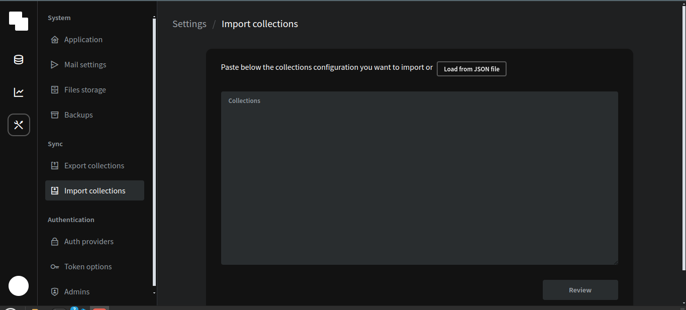

# Example

To run this example:

- `npm install` or `yarn`
- `npm dev` or `yarn dev`

Pocketbase setup

- download pocketbase [instructions](https://pocketbase.io/docs/)
- open settings>import collections and use this  [schema](src/lib/pb/schema.json)


remember to add envoroment varibles
```env
VITE_PB_URL="http://127.0.0.1:8090"

# create an admin user in pocketbase for types generation with the command "npm run pb-types" use it in dev mode only 
PB_ADMIN_EMAIL="uwu@email.com"
PB_ADMIN_PASSWORD="password"

```
